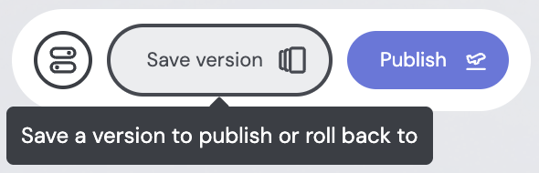

# Embeddable Handbook Style Guide

When updating [handbook](https://docs.embeddable.com/), please take into account the following **guidelines**.

## Audience

Each section of the handbook targets a different user-persona:

- **Data person**: comfortable writing SQL and working with databases, but may be new to Cube.
- **React engineer**: comfortable writing javascript, typescript and React, but may be new to using Embeddable’s sdk.
- **Dashboard builder**: typically non-technical product manager or data person, tasked with building dashboards using Embeddable’s no-code platform.
- **Integration engineer**: technical engineer, tasked with integrating Embeddable into their platform, but don’t assume they know anything about modeling or dashboard building.

When writing in each section, write as if you are speaking **to** them, **not** about them.

> E.g. when writing in the “Data modeling” section of the handbook, prefer “To start using the data model editor…” over “Data people can start using the data model editor…” .

| Section                 | Audience                            | Notes                                                                                                                                             |
| ----------------------- | ----------------------------------- | ------------------------------------------------------------------------------------------------------------------------------------------------- |
| **Introduction**        | Any                                 | For people who may never have heard of Embeddable. Assume they know nothing. They may still be deciding on whether to try Embeddable.             |
| **Getting Started**     | react engineer                      | For people who are setting up Embeddable for their team. They’re in their onboarding phase. They are typically technical (e.g. a react engineer). |
| **Connect your data**   | data person or integration engineer |                                                                                                                                                   |
| **Data modeling**       | data person                         |                                                                                                                                                   |
| **Building components** | react engineer                      |                                                                                                                                                   |
| **Dashboards**          | dashboard builder                   |                                                                                                                                                   |
| **Deployment**          | integration engineer                |                                                                                                                                                   |

## Linking and bolding

Whenever we're referring to important concepts in the platform, **link to the page** that talks about that content, rather than just **bolding the term.** Bolding an important term does two things:

- assumes the reader has already read about this concept and knows what you’re talking about (not necessarily the case, as they may have come directly to this page)
- puts the task of looking up more information about that concept upon the reader (and that’s risky as they may end up not finding the right section)

Whereas linking to the term:

- helps readers quickly navigate to what they’re looking for (they may actually be looking for that concept and found your page via search, but what they really want is to learn about that concept)
- helps readers learn more if they want to, without us needing to repeatedly explain concepts throughout the documentation.

Bolding **does** however make sense in lots of cases, such as:

- this page **is** the page that introduces and explains that concept (e.g. “**Dimensions** and **Measures** define how your data….”).
- you’re just highlighting emphasis words (not concepts), to help the reader focus on the important points (e.g. “you have **no limitations** on how you build”).
- you’re referring to concepts that don’t need explaining (e.g. “Each **order** is linked to one **customer** and one **product**.”)

## Screenshots and code snippets

Visuals almost always help the reader understand (and keeps reader engaged).

### Screenshots

If you’re talking about a part of the platform, include a screenshot below.

E.g.

> Click the **Save Version** button at the top of the dashboard builder to create a specific version:
>
> 

> [!TIP]
> Or even better if you can use a gif or a video.

### Code snippets

If you’re explaining how parts of the **sdk** or **Cube** work, provide code examples.

E.g:

> **Measures** are the values you aggregate (such as a count of users or total revenue).
>
> ```yaml
> measures:
>   - name: revenue
>     type: sum
>     sql: price_usd
> ```

## Short and to-the-point

The handbook is primarily a **reference manual**, not a **guide** or a **blogpost**.

- If you’re writing a **guide**, add it to the “More” section in the bottom-left of the handbook.
- If you’re writing a **blogpost**, add it to our Blog.

### Avoid casual language

Avoid:

> “If you just want to update your region, it’s a super straightforward process! Just head over to the `embeddable.config.ts` at the root level of the [Boilerplate Repo](https://github.com/embeddable-hq/embeddable-boilerplate)….”

Prefer:

> To update your region, you’ll need to edit the `embeddable.config.ts` file at the root level of the Boilerplate Repo…”

### Use bullet points

Avoid:

> “Let’s break down what’s happening here. First, we’re bringing in the `Theme` type from Vanilla Components to help with type consistency, and the `defineTheme` function from the same repo, which we use to help us merge our changes into the default Vanilla Components theme”

Prefer:

> Things to notice:
>
> 1. we’re bringing in the `Theme` type from Vanilla Components to help with type consistency.
> 2. the `defineTheme` function helps us merge our changes into the default Vanilla Components theme.

## Start with Why?

A good rule-of-thumb for any page your writing is: start with “Why should the audience read this page? What context can I give them, straight away, so they know if they’re in the right place?”

A good structure:

- **Start with What + Why:** Assume the reader has the baseline skills but has never heard of this concept. Define it simply, and explain why it matters.
- **Show a practical example early:** Lead with a minimal, concrete example so the reader can immediately picture what’s being introduced (can be code, a screenshot or even a video).
- **Explain How step-by-step:** After the example, walk through implementation clearly and concisely, using code/config/screenshots where possible.
- **Separate core concepts from variations:** Keep the main flow clean. Put differences, edge cases, or advanced details in their own section.
- **Write for scanning:** Use short sections, headings, and bullets so someone can grasp the essentials quickly, then dive deeper if they want.

A good template to use could be something like this:

```md
# Broccoli 🥦

Broccoli is a green vegetable, similar to Cucumbers, but better.

## Why eat Broccoli?

...

## How to use Broccoli

A simple way to get started with Broccoli is to ...

... <an example>

Things to notice:

- ...
- ...
- ...

## Examples

### Garlic Butter Sautéed Broccoli

...

### Broccoli Potato Soup

...
```

---

<picture>
  <source media="(prefers-color-scheme: dark)" srcset="https://docs.embeddable.com/img/logos/colour-horizontal-white-transparent.png, https://docs.embeddable.com/img/logos/colour-horizontal-white-transparent@2x.png 2x">
  <source media="(prefers-color-scheme: light)" srcset="https://docs.embeddable.com/img/logos/colour-horizontal-black-transparent.png, https://docs.embeddable.com/img/logos/colour-horizontal-black-transparent@2x.png 2x">
  
</picture>

[Embeddable](https://embeddable.com/) is a developer toolkit for building fast,
interactive, customer-facing analytics directly into your product.
Fully customize analytics dashboards using React.js, and seamlessly
integrate them anywhere with Web Components.

Discover more about Embeddable by reading our [Docs](https://docs.embeddable.com/),
[Customer Stories](https://embeddable.com/customer-stories), and [Blog](https://embeddable.com/blog).
